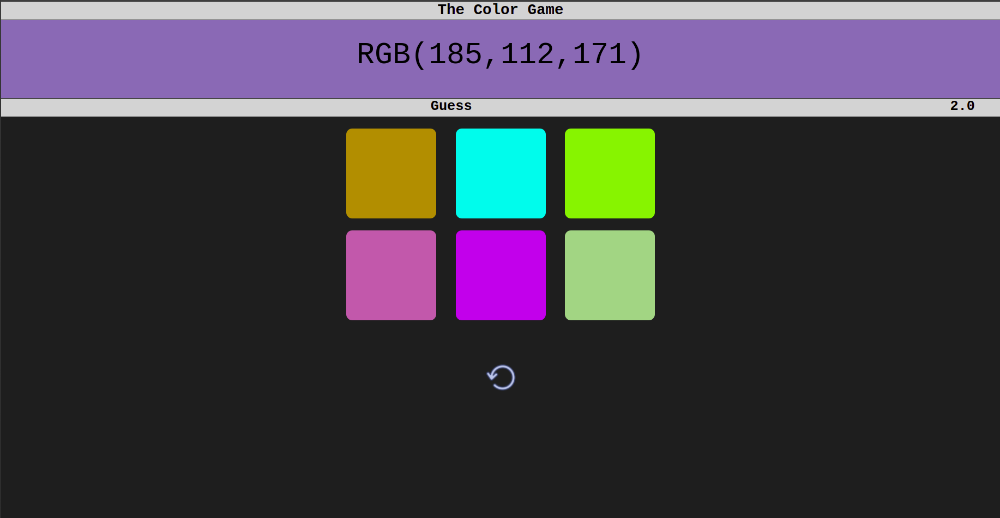

# Color-Game
Game that challeges your understanding of RGB Color format

## Do you think you know how does RGB(180,140,130) looks like or RGB(56,177,213)?
## Then, try your reasoning or luck on this game...

To clone the repository
```
  git clone https://github.com/anonymous372/Color-Game.git
```

## Screenshot of the game in action

